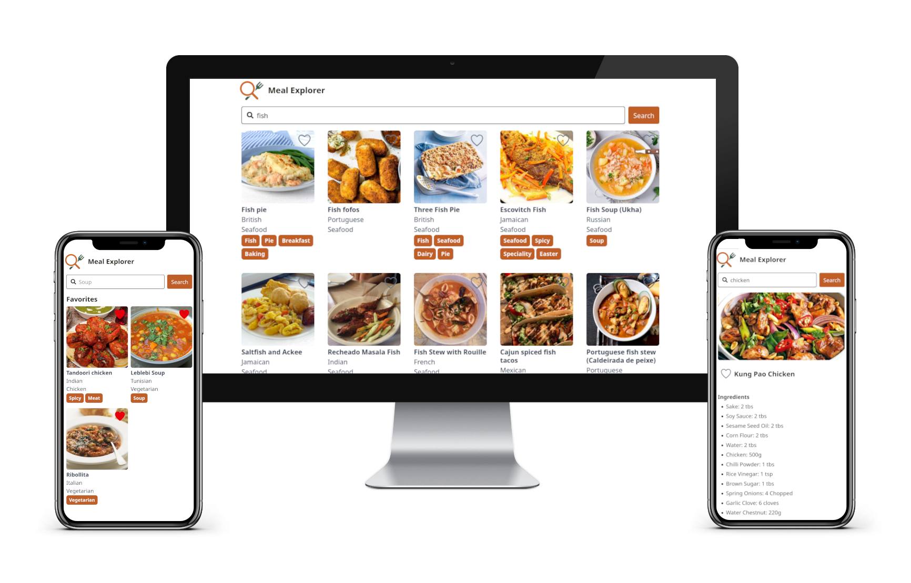

# The Meal Explorer app!

A simple app to browse meals, inspect their recipes and save them as favorites.

## Preview



## Teck stack

- 📦 Vite (Bundler)
- 🚀 React + React Router (Frontend framework)
- 🔒 TypeScript
- 🎉 Tailwind (CSS framework)
- 🌍 Axios (HTTP client)
- 🔎 Cypress (E2E Tests)

## Getting Started

### Installation

Install the dependencies:

```bash
npm install
```

### Development

Start the development server with HMR:

```bash
npm run dev
```

Your application will be available at `http://localhost:5173`.

### Run test

E2E tests require a running server that will be queried by Cypress.
This can be done running a docker image locally to simulate a production environment, or more simply with a host dev server:
```bash
npm run dev -- --host
```

With that, to open cypress interface use:
```bash
npx cypress open
```

## Building for Production

Create a production build:

```bash
npm run build
```

## Deployment

### Docker Deployment

To build and run using Docker:

```bash
docker build -t my-app .

# Run the container
docker run -p 3000:3000 my-app
```

The containerized application can be deployed to any platform that supports Docker, including:

- AWS ECS
- Google Cloud Run
- Azure Container Apps
- Digital Ocean App Platform
- Fly.io
- Railway

## App structure

The App is a singe-page application (SPA) that uses [themealdb.com APIs](https://www.themealdb.com/).
It is structured into 2 main views.
The "home" or meals view, where users can browse for meals or quickly look at their favorite meals;
and the intructions view, where the meal ingredients and instructions are shown.

To keep the app navigation simple the searchbar is always visible and allows to quickly return to the meal browsing view of the app.

Favorite meals of the users are saved locally in the browser `localStorage`.

## Challenged and architectural decisions

### The themealdb API key

The themealdb API requires an API key.
It's not a good idea to store sensible data inside a frontend so it would be best to have a backend perform API requests using this key and let users access that backend using a standard login mechanism.
An other way to workaround the issue would be to ask the API key directly to the user, but that wouldn't be a good UX.
For the purpose of this app, being a SPA, the API key is imported as an ENV variable.

### Favorite storage

Technically, only the meal ID is required to mark a meal as favorite, but saving only the ID would require a re-fetch of every favorite meal when previewing the favorite meal list. Sadly themealdb has no API to retrieve meals from a ID list.
Assuming the ID of meals never change, the full meal structure is saved locally to optimize performances.
This would also require some cache invalidation, for example, refresh meals every week or when visualizing their instructions to keep in sync with the remote DB.

### Preparation time

While it would be good to have a preparation time on every recipe, it is not currently returned by the API, and thus, excluded from the app.

### Ingredients and area

Themealdb API provides a way to list areas, ingredients and categories.
Altough it would be easy to add a search-by option in the searchbar using those lists, this was excluded from the app to keep the overall effort limited.
This may be a nice improvement to be added on a later date.
